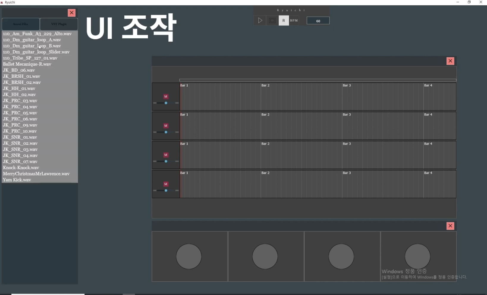

<h1 align="center">
  <a href="https://www.youtube.com/watch?v=Q7ig6vn-y4M">
    
  </a>
  <span style="vertical-align: middle;">
    Ryuichi MINI-DAW(샘플 작곡 소프트웨어) — JUCE × Rust (FFI)
  </span>
</h1>

<p align="center">
  <em>JUCE 기반 C++ UI + Rust 오디오 엔진(DLL) — 디코딩 · VST3 · 믹싱 · 출력(JUCE)</em><br/>
  <sub>Lock-free ring buffer(rtrb), Symphonia 디코더, JUCE 오디오 출력</sub>
</p>

<p align="center">
  <a href="https://www.rust-lang.org/"></a>
  <a href="https://juce.com/"></a>
  
  
  
</p>

<hr/>

---

## 목차
- [1. 프로젝트 소개](#1-프로젝트-소개)
- [2. 프로젝트 개요](#2-프로젝트-개요)
- [3. 주요 모듈](#3-주요-모듈) 
- [4. 기술스택](#4-기술스택)
- [5. 참고사항(설치및 사용방법으로)](#5-참고사항설치및-사용방법으로)

---

## 1. 프로젝트 소개
> Ryuichi MINI-DAW고, 내용은 **샘플 작곡 소프트웨어**입니다.

### 무엇을 할 수 있나
- 오디오 클립을 트랙에 올리고 재생/정지
- 트랙별 볼륨/팬/뮤트 조절
- VST3 플러그인 창 열기 및 이펙트 적용
- 48kHz stereo 기준 실시간 출력

### 기본 사용 흐름(짧게)
1. Assets 로드
2. 트랙에 사운드 배치
3. PlayBar에서 재생/정지/BPM 조작
4. Mixer/Track UI에서 파라미터 조절
5. (선택) VST3 로딩 후 이펙트 적용

---

## 2. 프로젝트 개요

### 아키텍처 요약
- **C++ (JUCE)**: UI, 플러그인 호스트, AudioCallback 출력, 타임라인/트랙 상태 관리
- **Rust (DLL)**: 디코딩/믹싱/버퍼링 등 오디오 엔진 로직
- **FFI**로 엔진 핸들을 생성/해제하여 런타임 연결

---

## 🗂️ 폴더 구성 (Repo 기준)

| 경로(Path)                  | 설명 |
|----------------------------|------|
| `Source/`                  | 메인 소스 루트 |
| `Source/Main/`             | 메인 엔트리/부트스트랩 |
| `Source/AudioEngine/`      | 오디오 엔진 관리, I/O, 콜백 연동(FFI 포함) |
| `Source/AssetsPath/`       | 에셋 경로 유틸/로더 |
| `Source/ClipData/`         | 오디오 파형/클립 데이터(시각화) |
| `Source/soundData/`        | 파라미터 저장소(볼륨/팬/뮤트 등) |
| `Source/TimeLineState/`    | 타임라인 상태/핸들러(재생 위치/BPM 등) |
| `Source/GUI/`              | GUI 전반 |
| `Source/GUI/BackGround/`   | 메인 배경/레이아웃 |
| `Source/GUI/VST3Window/`   | VST3 윈도우 관리 |
| `Source/GUI/SoundSource/`  | 사운드 에셋 브라우저/뷰 |
| `Source/GUI/Button/`       | 버튼 위젯/이벤트 |
| `Source/GUI/Track/`        | 트랙 UI |
| `Source/GUI/Slider/`       | 트랙 볼륨/슬라이더 |
| `Source/GUI/Mixer/`        | 믹서 UI |
| `Source/GUI/PlayBar/`      | 재생/정지/BPM 컨트롤 |
| `Source/GUI/LookAndFeel/`  | 커스텀 Look&Feel 테마 |
| `Source/Sound/`            | 오디오 콜백/출력 관리 |

---

## 3. 주요 모듈
### 🎧 실시간 오디오 출력 (JUCE AudioCallback)
**파일:** [Source/AudioHostController.h](https://github.com/damien-cpp-rt/Ryuichi_DAW/blob/master/Source/AudioHostController.h)  
💡 기능: 오디오 디바이스 콜백에서 출력 버퍼를 실시간으로 채움 (실시간 엔트리 포인트)  
📌 포인트:
- 실시간 구간(락/할당/IO 금지)
- 파라미터 스냅샷 반영(볼륨/팬/뮤트)

---

### 🔗 C++ ↔ Rust FFI 브리지
**파일:** [Source/AudioEngine.h](https://github.com/damien-cpp-rt/Ryuichi_DAW/blob/master/Source/AudioEngine.h)  
💡 기능: Rust DLL 엔진 핸들 생성/해제 및 호출 경계 유지 (ABI 경계 고정)  
📌 주요 API(예시):
- `rust_audio_track_new / free`
- `rust_audio_engine_new / free`

---

### 🧠 파라미터 저장소
**파일:** [Source/soundData.h](https://github.com/damien-cpp-rt/Ryuichi_DAW/blob/master/Source/soundData.h)  
💡 기능: UI에서 변경된 파라미터를 오디오 콜백이 읽을 수 있게 제공 (상태 저장소)

---

### 🧭 타임라인/트랜스포트 상태
**파일:** [Source/TimeLineState.h](https://github.com/damien-cpp-rt/Ryuichi_DAW/blob/master/Source/TimeLineState.h)  
💡 기능: 재생/정지/플레이헤드/BPM 등 시간 상태 관리 (시간의 단일 진실)

---

### 🌊 클립/파형 데이터
**파일:** [Source/ClipData.h](https://github.com/damien-cpp-rt/Ryuichi_DAW/blob/master/Source/ClipData.h)  
💡 기능: 파형 데이터 생성/캐시 및 타임라인 표시용 데이터 제공

---

### 🧩 VST3 관리
**파일:** [Source/VSTWindows.h](https://github.com/damien-cpp-rt/Ryuichi_DAW/blob/master/Source/VSTWindows.h)  
💡 기능: VST3 플러그인 로딩 및 에디터 창 관리 (플러그인 수명 + UI attach/detach)

---

### 🏠 MainComponent (App Root)
**파일:** [Source/MainComponent.h](https://github.com/damien-cpp-rt/Ryuichi_DAW/blob/master/Source/MainComponent.h)  
💡 기능: 앱의 루트 컴포넌트로서 UI/오디오/상태 객체를 초기화하고 연결  
📌 포인트:
- 주요 UI 컴포넌트 생성 및 레이아웃(Track/Mixer/PlayBar 등)
- 상태(TimeLineState/soundData)와 UI 이벤트 바인딩
- AudioHostController/AudioEngine(FFI) 초기화 및 연결
- 앱 종료 시 리소스 정리(엔진 핸들/free, 오디오 stop 등)

---

## 4. 기술스택
- JUCE(C++) 오디오 프레임워크
- Rust

---

## 5. 참고사항(설치및 사용방법으로)
### 🧰 사전 준비 (Windows)
- **Projucer** 설치
- `Ryuichi.jucer` 프로젝트 오픈
- Visual Studio 2022 Exporter 설정 확인
- 비주얼 스튜디오 빌드 진행

> 실행 시 DLL 파일이 없다면 "정상" (Rust 엔진을 아직 안 붙였기 때문)

---

### 📦 필수 에셋(Assets)
필수 에셋:
- [Assets 다운로드](https://drive.google.com/file/d/1m9ydxmQDN2TVKN6PVAy9Syy_I6pJ7Srv/view?usp=sharing)

```text
Assets.zip 파일 다운로드 후,
C:\Ryuichi\Builds\VisualStudio2022\x64\Debug\App (또는 Release\App)
경로에 압축을 해제하여 디렉토리 형태로 넣어준다.
```

---

## ⚙️ Rust 엔진 빌드(DLL)
- **Rust(cargo)** 설치
<br/>
Ryuichi\RustSource\ryuichi를 vscode를 통하여 폴더 Open 터미널을 통하여 

```powershell
cargo build --release 빌드
```
<br/>

1. 빌드 완료 이후 Ryuichi\RustSource\ryuichi\target\release 폴더 안에 ryuichi.dll 파일 복사 
2. Ryuichi\Builds\VisualStudio2022\x64\Debug(아님 Release)\App 에 붙여 넣기
3. Projucer에 Exporters 설정이 안되어있다면 진행

```
Projucer에 Exporters 설정 Visual Studio 2022에 Debug , Release 둘다
Extra Library Search Paths -> Rust 릴리즈 빌드 하여 추출된 DLL 파일 경로를 입력 (예시:RustSource\ryuichi\target\release)
Configuration-specific Linker Flags -> Rust 릴리즈 빌드하여 생성된 DLL 파일 이름을 등록 (예시:ryuichi.dll.lib)
```

---
